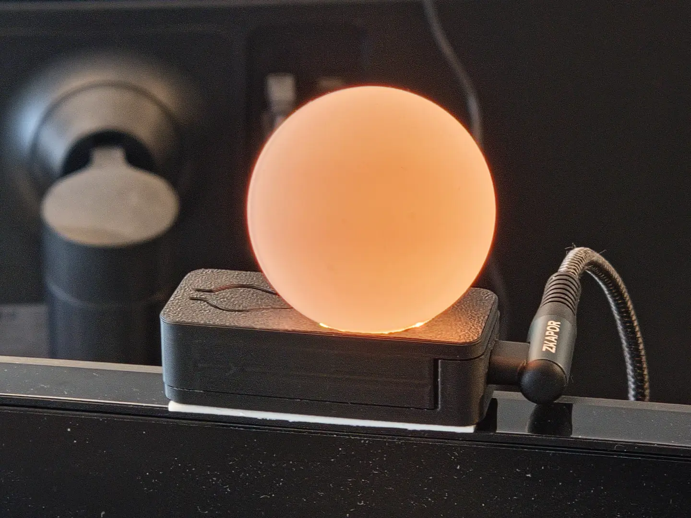
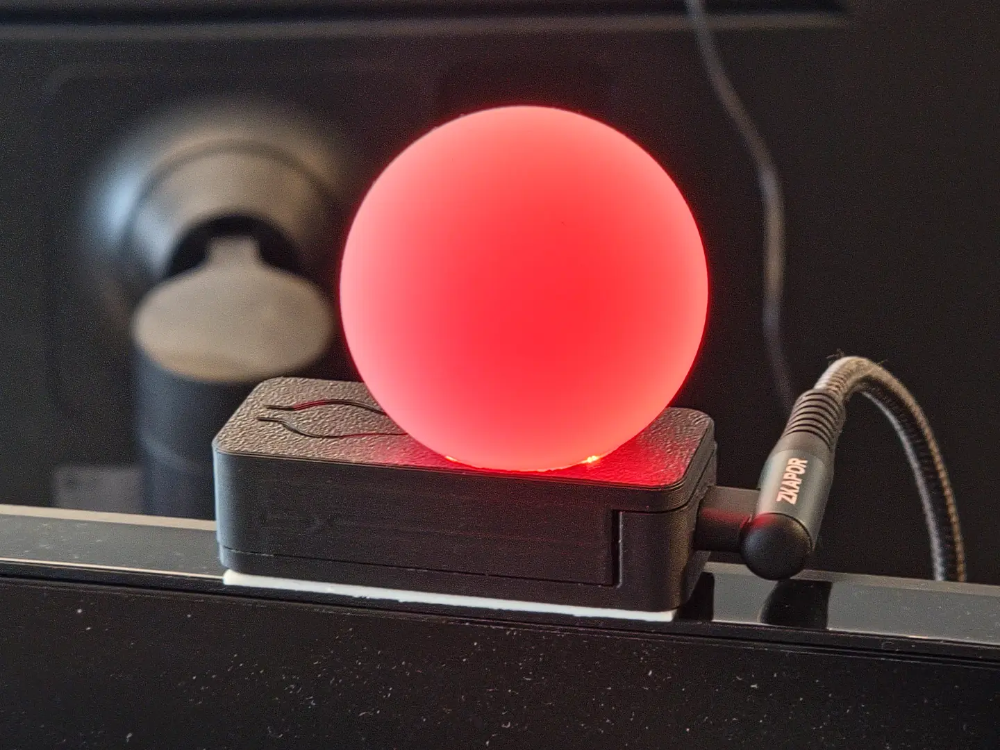

# BusyBeacon

<p>



</p>

An indicator that shows coworkers if you are busy.

Intended to be mounted to your monitor and updated whenever your current state changes.

### Color Meanings
- 🟢 **Green** - Can be talked to casually.
- 🟡 **Yellow** - Concentrated, only talk to about the current project.
- 🔴 **Red** - In the zone, do not talk to unless absolutely necessary.

### Controls

- Button:
    - Short press: Switch between colors
    - Long press: Turn on/off
- USB:
    - USB-HID device that can be used to set the color and switch it on/off
    - Turns off when the USB data connection stops (e.g. the PC is shut down).
        - Intended for monitors that power the device constantly, even if the PC is off

## Parts

- Table Tennis Ball as light diffusor
    - For best experience, choose seamless balls
- [Custom PCB](https://oshwlab.com/finomnis/busylight)
    - Orderable on JLCPCB for ~60 Euros / 10 PCBs
- 3D Printed Case
- LEDs: BTF-LIGHTING 144LEDs/m WS2812B
    - German Amazon: https://amzn.eu/d/06CgZDho
    - 3 LEDs needed per device


## Host software

The device can be controlled from the PC using the following programs:

- `busybeacon` - A tray icon with a menu
- `busybeacon-cli` - A command line tool

For Windows, precompiled executables can be found in the releases page.

- Copy `busybeacon.exe` into `%APPDATA%\Microsoft\Windows\Start Menu\Programs\Startup` to start it automatically on bootup.
- Once it runs, right click on taskbar -> `Taskbar settings` -> `Other system tray icons` -> `busybeacon.exe` -> `On` to show it in the taskbar

For Linux / MacOS, the `software` directory contains the source code
that can be compiled as usual:

```shell
cd software
cargo build --release
```

MacOS is currently untested.

## Firmware

The newest version can be found in the releases page.

The bootloader and firmware have to be installed once from the `.hex` files:

```shell
probe-rs download --binary-format hex --chip stm32u073cc --verify busybeacon.bootloader.hex
probe-rs download --binary-format hex --chip stm32u073cc --verify busybeacon.hex
```

Afterwards, the application can be updated via the `.dfu` file:

```shell
dfu-util --download busybeacon.dfu
```

If DFU flashing fails, enter bootloader recovery mode by keeping the button pressed while plugging in the device. It should then react to `dfu-util` again.

**NOTE:** It is normal that `dfu-util` ends with an error message like so:
```
Download        [=========================] 100%        90672 bytes
Download done.
dfu-util: unable to read DFU status after completion (LIBUSB_ERROR_IO)
```

This is a technical limitation that might get fixed in the future, but it's purely cosmetic.

## Build Instructions

1. Download the relevant files from the [Releases page](https://github.com/Finomnis/busybeacon/releases).
2. Flash the PCB with the latest bootloader & firmware.
   - This requires a TC2050 adapter and a suitable probe.
   - For more information, see [firmware](https://github.com/Finomnis/busybeacon/tree/main/firmware).
3. Print the case (top and bot)
4. Cut 3 LEDs from your BTF-LIGHTING 144LEDs/m WS2812B strip
5. Connect the PCB and the LEDs with three wires
6. Insert the PCB into the bottom case and glue the LED strip on the little
   shelf that will face the ball
7. Cut a hole in your tennis ball that fits the three LEDs
8. Glue the Ball on the Top case
9. Slide the case together

Then, plug the device into a USB-C port and you will see the ball light up green.

You can now control the ball using the button as described in the `Controls` section, or you can install the tray icon app to control it via a tray icon of your PC.
